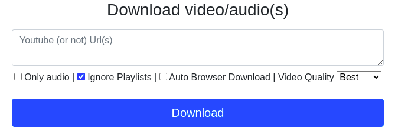
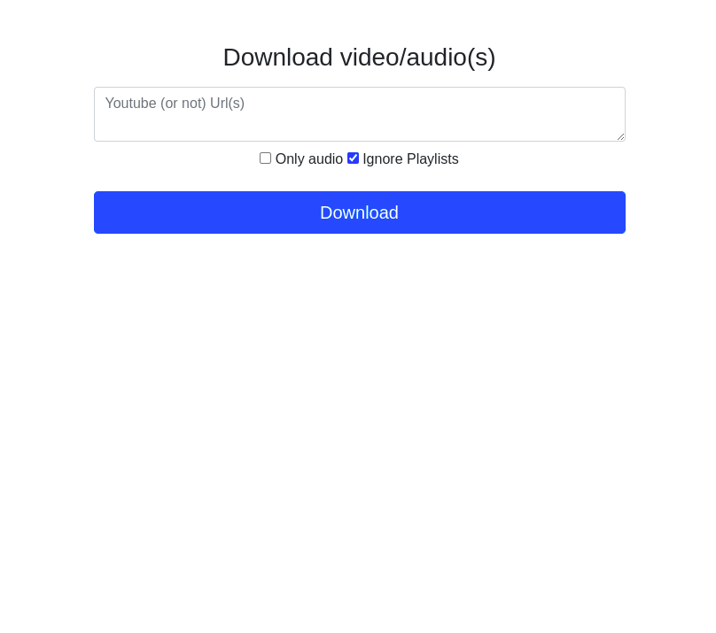

# youtube-dl-webui

Keys: download videos and audio for many platforms + webui + multi urls and playlists + download to your browser + video quality selection + ytb-dl auto-update + Docker native + light + Raspberry PI Compatible

A simple Web UI to download Video/Sound from youtube and others platforms.

## Quick Start with Docker Compose

Start the application:
```bash
docker compose up -d
```

Stop the application:
```bash
docker compose down
```

Access the web interface at: http://localhost:8080 (Note: Only accessible from localhost for security)

## Features

- Multi-platform video/audio downloads
- Video quality selection (Best, Full HD, HD)
- Audio-only downloads
- Playlist support (with option to ignore)
- Automatic browser download option
- **Automatic cleanup**: Downloaded files are automatically deleted after 24 hours to manage disk space
- Docker-native and Raspberry PI compatible

## API Endpoints

- `POST /start`
  - Start a new download
  - Request body:
    ```json
    {
      "urls": ["url1", "url2"],
      "onlyAudio": boolean,
      "ignorePlaylists": boolean,
      "autoBrowserDownload": boolean,
      "videoQuality": "best" | "fhd" | "hd"
    }
    ```
  - Response: `{ "uid": "download-id" }`

- `GET /status/:uid`
  - Get download status
  - Response:
    ```json
    {
      "status": "YOUTUBE-QUEUE" | "YOUTUBE-DOWNLOADING" | "YOUTUBE-ERROR" | "READY" | "BROWSER-DOWNLOAD" | "DONE" | "CANCELED",
      "targetFile": "filename",
      "doneOrCanceledAt": "timestamp",
      "onlyAudio": boolean,
      "videoQuality": "quality",
      "autoBrowserDownload": boolean
    }
    ```

- `GET /download/:uid`
  - Download the processed file
  - Returns file stream when ready

- `GET /cancel/:uid`
  - Cancel an ongoing download

- `GET /downloads`
  - List all downloads and their status

## Updated interface



## Demo (some versions ago)



## Alternatives

- The CLI tool (That makes 99% of the job) : https://github.com/yt-dlp/yt-dlp
- WebUIs :
  - https://github.com/d0u9/youtube-dl-webui
  - https://github.com/timendum/Youtube-dl-WebUI
  - https://github.com/manbearwiz/youtube-dl-server
  - https://github.com/Tzahi12345/YoutubeDL-Material
  - https://github.com/Rudloff/alltube
- Some GUIs are also available

## Security Note

For security reasons, this application only accepts connections from localhost. If you need to access it from other machines, you'll need to set up a reverse proxy with proper authentication.
